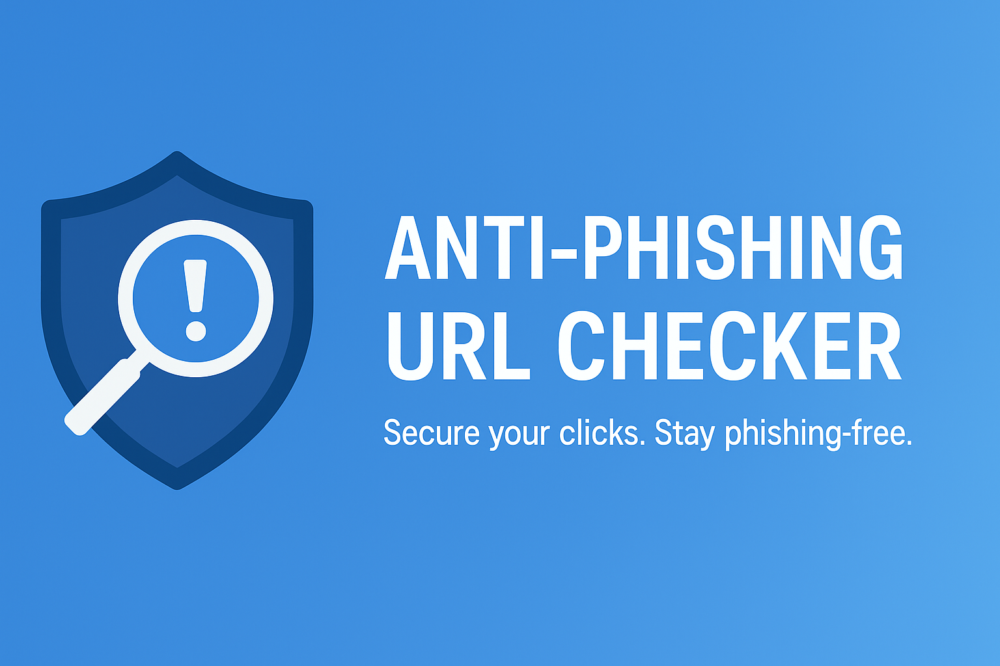

# Phishing_URL_Check
A simple web-based Anti-Phishing URL Checker built by a student using HTML, CSS, and JavaScript. It checks user-entered URLs against a small list of known phishing sites and gives a basic warning if detected. Made for learning and demonstration purposes.

# Anti-Phishing URL Checker

A simple web-based tool to detect potentially phishing URLs using basic pattern matching. Built as a student project to demonstrate basic web development and cybersecurity awareness.

## Features

- Takes a user-entered URL and checks against a list of known phishing domains
- Highlights whether a URL is safe, malicious, or invalid
- Instant response in a clean, user-friendly interface
- Fully browser-based; no backend required.

## How It Works

The app uses JavaScript to:
1. Accept a URL input from the user.
2. Validate the format using the `URL` object.
3. Match the domain (`hostname`) against a list of known phishing sites.
4. Display a warning or success message with color-coded results.

## Technologies Used

- HTML5
- CSS3
- JavaScript (Vanilla JS)

## Getting Started

To run the project locally:

1. Clone this repository:
   ```bash
   git clone https://github.com/yourusername/anti-phishing-url-checker.git
   cd anti-phishing-url-checker
 ## TO RUN THIS
  https://github.com/mohd-rehan13/Phishing_URL_Check.git
